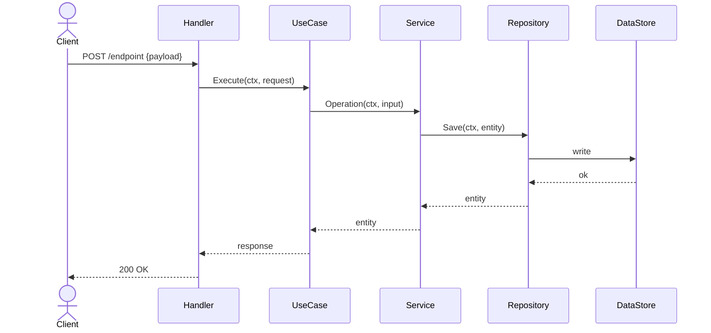

# Feature Lead Templates

> Format specs and examples for the Feature Lead agent. Load this file when you need a specific template.

---

## RFC Template

```markdown
# RFC: [Feature Name]

**Status:** Draft
**Author:** [name or team]
**Reviewers:** [names]
**Date:** [date]

---

## 1. Background
[Context that explains why this problem exists. What is the current state of the system?]

## 2. Problem Statement
[Clear, specific description of what is broken, missing, or needs improvement.]

## 3. Goals
- [Measurable or observable goal 1]
- [Measurable or observable goal 2]

## 4. Non-Goals
- [What this RFC explicitly does NOT address]

## 5. Proposed Solution
[High-level description of the approach. Explain "what" and "why" — not "how". Filled in after Phase 3.7.]

## 6. Alternatives Considered
| Alternative | Why Rejected |
|-------------|--------------|
| [Option A]  | [Reason]     |

## 7. Open Questions
- [ ] [Question that must be resolved before or during implementation]

## 8. Success Metrics
- [How we measure success after rollout — behavioral, business, or operational]

## 9. Stakeholders
- **Author:** [name]
- **Engineering lead:** [name]
- **Reviewers:** [names]
- **Approvers:** [names]

## 10. Rollout Strategy
_Filled in after Phase 4 (Infra Planning) gate. Decided by the user._
- **Strategy:** [direct deploy / feature flag / dark launch / canary]
- **Rollback plan:** [how to revert if alarms fire after deploy]
- **Migration / data backfill:** [required? when? forwards + backwards?]
- **Communication:** [who needs to know when this ships?]

## 11. Contracts
_Filled in after Phase 3.5 (Contract Definition) gate._
[API contracts, event schemas, data-schema changes]
```

---

## Mermaid Sequence Diagram — Base Template

Store `.mmd` files in `docs/flows/[feature-name]/`. Renders natively in the code host's PRs and tickets.



Draw separate diagrams for: async flows (queue/topic), event consumers, meaningful error paths.

---

## Contract Definition Formats

**API contract:**

```
Endpoint: POST /path
Request:  { field: type, required/optional }
Response: { field: type }
Errors:   { code | message | when triggered }
```

**Event payload schema:**

```
Event:    [domain.entity.action]
Producer: [domain/service]
Consumer: [domain/service]
Payload:  { field: type }
```

**Data-schema change:**

```
Store:       [table/collection name]
New fields:  field type [constraints]
Modified:    field old_type → new_type
New indexes: [definition]
Migration:   required yes/no — forwards + backwards scripts
```

---

## Solution Alternatives Format

```
### Alternative A — [Descriptive Name]

**Approach:** [1-2 sentence description of the technical strategy]

**Changes by area:**
- Handler/Worker: [what changes]
- Service/UseCase: [what changes]
- Repository: [what changes]
- Infrastructure: [what changes]

**Pros:**
- [Concrete advantage]

**Cons:**
- [Concrete disadvantage or risk]

**Complexity:** Low / Medium / High
```

---

## Ticket Skeleton

```
Epic: [Feature Name]
  ├─ Ticket: Infra Setup                   [DevOps — IaC config, permissions]
  ├─ Ticket: Domain Model                  [models, domain errors — no deps]
  ├─ Ticket: Repository Layer              [depends on: Domain Model]
  ├─ Ticket: Service Layer                 [depends on: Repository Layer]
  ├─ Ticket: Use Case Layer (if needed)    [depends on: Service Layer]
  ├─ Ticket: Handler                       [depends on: Use Case or Service Layer]
  └─ Ticket: Integration & Wiring          [depends on: Handler]
```

---

## Stacked PR Branch Structure

```
default branch
 └── feat/[feature-name]                   ← parent PR → default branch (draft until all sub-PRs merged)
      ├── feat/[feature-name]-models        ← sub-PR → feat/[feature-name]
      ├── feat/[feature-name]-repository    ← sub-PR → feat/[feature-name]
      ├── feat/[feature-name]-service       ← sub-PR → feat/[feature-name]
      └── feat/[feature-name]-handler       ← sub-PR → feat/[feature-name]
```

---

## PR Description Format

All PRs use the repository's PR template (`.github/pull_request_template.md`) if one exists. Fill as follows:

**Sub-PR:**

- Description: what this slice does + links to sibling PRs ("Part of #123, #124")
- Task Context: current vs new behavior for this layer only
- Checklist: unit / local at minimum (`task test:unit`)

**Parent PR** — same template plus append:

```
## Sub-PRs
- #[number] — [title]

## RFC
[RFC link]
```

---

## Batch Execution Example

```
Batch 1: [Infra Setup] [Domain Model]              ← parallel, no deps
Batch 2: [Repository Layer]                        ← depends on Domain Model
Batch 3: [Service Layer]                            ← depends on Repository
Batch 4: [Use Case Layer] [Handler]                ← parallel, both depend on Service
Batch 5: [Integration & Wiring]                    ← depends on Handler
```

All tickets in a batch are delegated to Orchestrator Dev **in the same message** as simultaneous agent calls.
